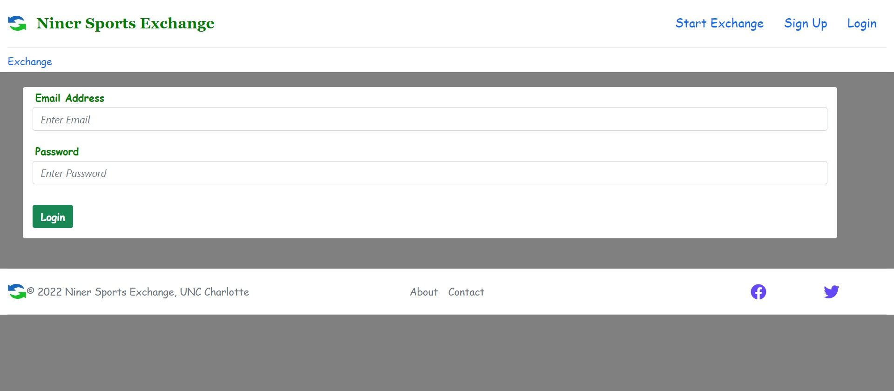
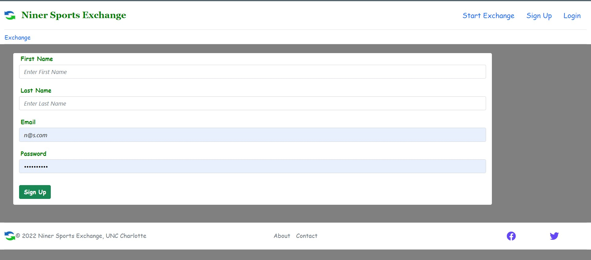
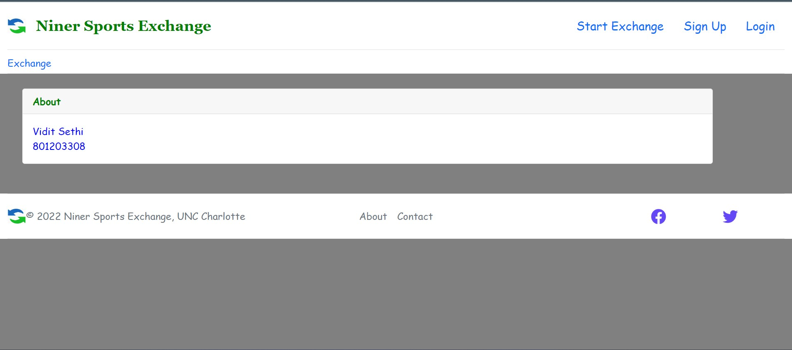
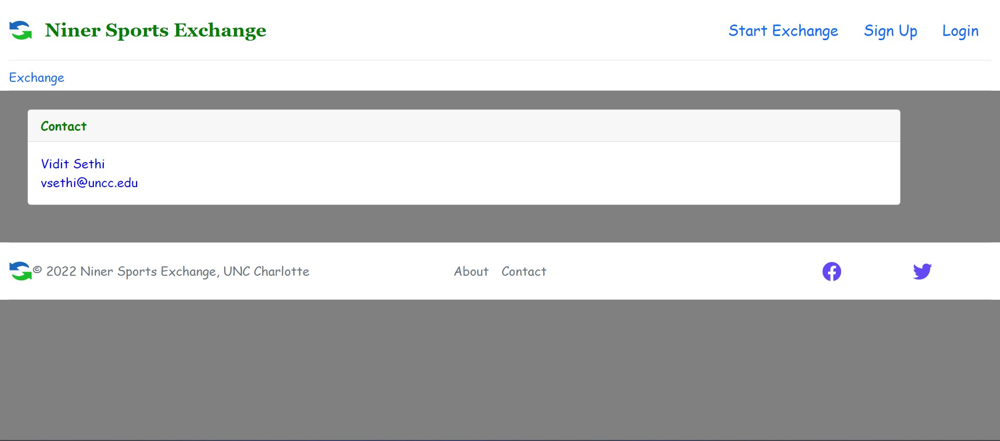
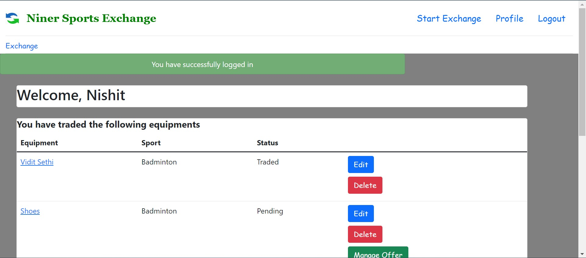
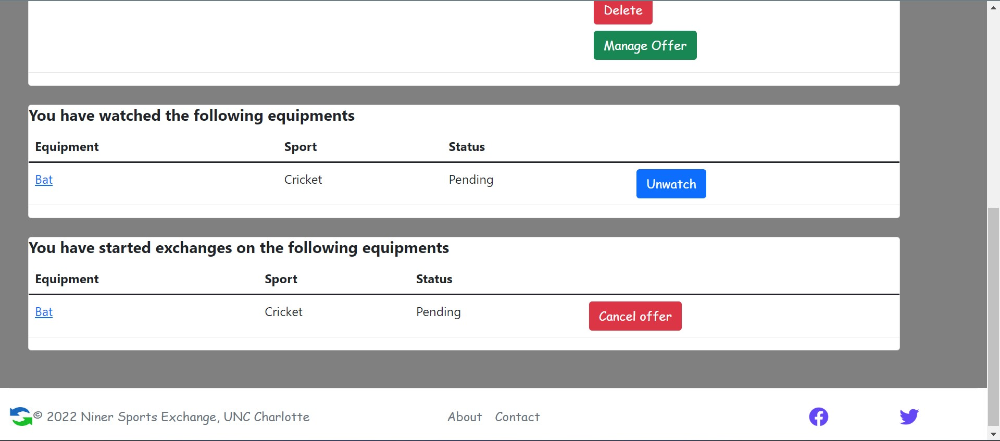
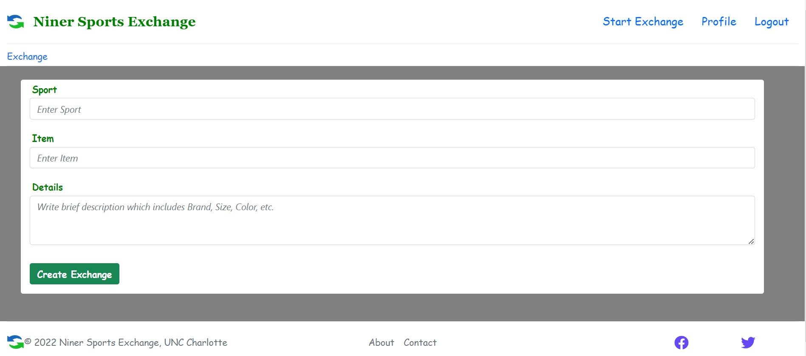
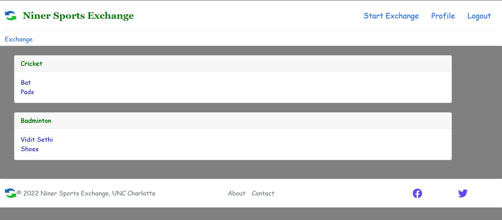
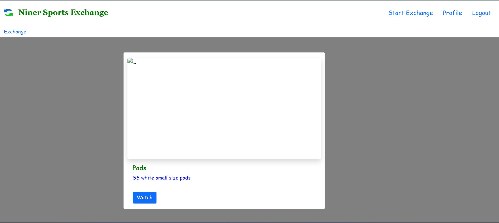
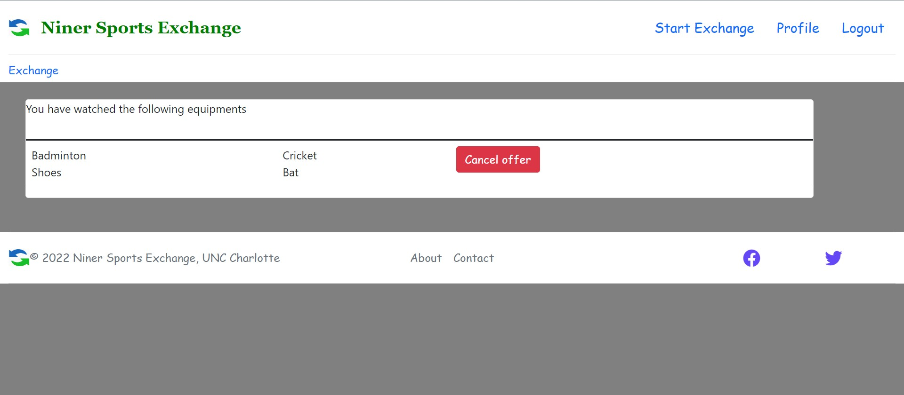

<h1> NinerSportsExchange </h1>
  The NinerSportsExchange aims to create a platform for users to exchange sports equipment. Users can list their items for exchange and interact with other users to accept or reject exchange requests. In addition to the main exchange functionality, the project includes features specifically designed for a watch device. These features include user notifications for real-time updates, exchange reminders, item tracking with GPS, activity tracking for fitness monitoring, social media integration, and customizable watch faces. It leverages Node.js and its ecosystem to build a robust and interactive platform for sports equipment exchange, enhancing the user experience through the watch device.
<h2> Installation </h2>
  <ul>
    <li> Clone the Git repository by running the following command: </li>
        git clone https://github.com/viditsethi13/NinerSportsExchange.git
    <li> Once the repository is cloned, navigate into the project directory: </li>
        cd NinerSportsExchange
    <li> run the following command to install the dependencies: </li>
        npm install
    <li> Use the following command to run the project: </li>
        nodemon app.js
  </ul>

<h2> Screenshots </h2>
  Login
  
  Sign Up
  
  About
  
  Contact
  
  Profile
  
  Profile
  
  Start Exchange
  
  Exchange Home
  
  Exchange Details
  
  Manage_Offer
  

<h2> Architecture </h2>
  
 This Node.js project follows the Model-View-Controller (MVC) architectural pattern. The components are organized as follows:

  <ul>
    <li><b>Model:</b> The models in this project represent the data structure and handle interactions with the database or any external data sources. They encapsulate the data logic and provide methods for querying, creating, updating, and deleting records.</li>
    <li><b>View:</b> Views handle the presentation layer of the application. They are responsible for rendering the user interface and displaying data to the users. In this project, views are typically implemented using HTML, CSS, and any relevant front-end frameworks or templating engines.</li>
    <li><b>Controller:</b> Controllers handle the business logic and act as an intermediary between the models and views. They receive requests from the clients, interact with the corresponding models to retrieve or manipulate data, and pass the data to the appropriate views for rendering.</li>
  </ul>
  This separation of concerns allows for better organization, maintainability, and scalability of the codebase. It promotes modularity and reusability by keeping the data, presentation, and logic separate. 
  
<h2> Contributing </h2>
  
 Contributions are welcome! If you would like to contribute to this project, please reach out to me via email at viditsethi13@gmail.com.

  Please include the following information in your email:
  <ul>
    <li>Your name </li>
    <li>Your area of expertise or interest </li>
    <li>How you would like to contribute to the project </li>
  </ul>
  I will get back to you as soon as possible with further details on how you can get involved. Thank you for your interest and willingness to contribute!  
  Feel free to modify the email address and instructions to suit your specific needs.
  
<h2> Contact </h2>
  If you have any questions or comments about the App, please contact me at viditsethi13@gmail.com.
